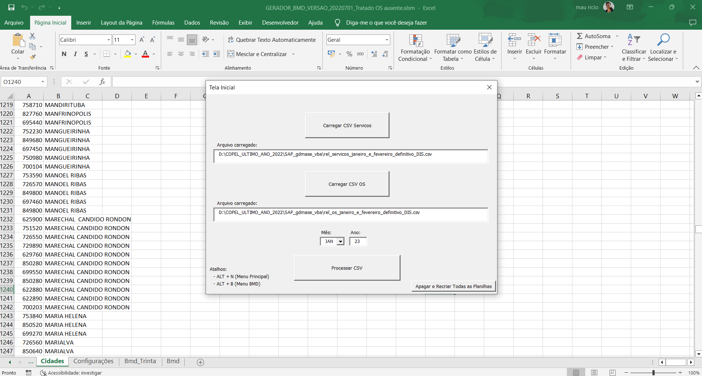
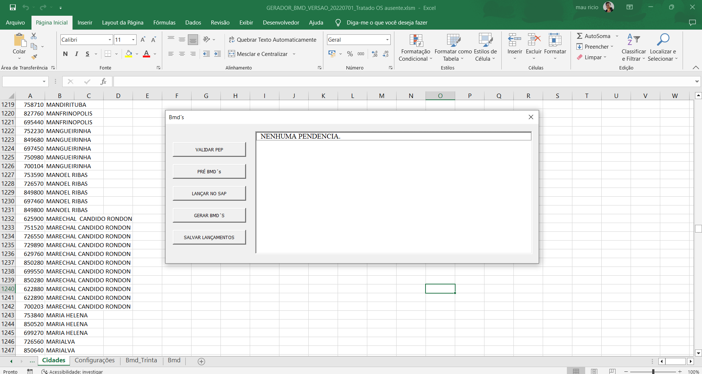
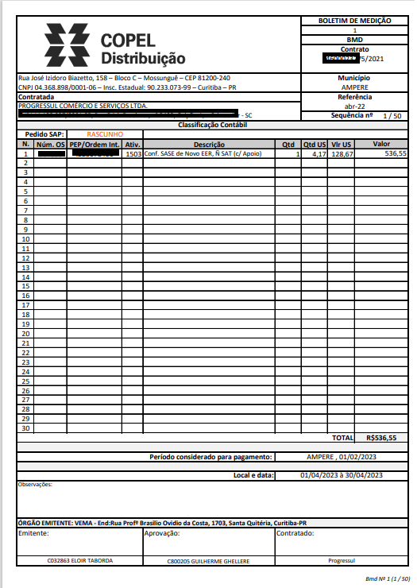

# Integração SAP x CSV

---

## **Aplicativo baseado em Excel desenvolvido em Visual Basic For Aplication.**

* Este aplicativo faz o tratamento de dados de dois arquivos Csv´s e realiza lançamentos automatizados na plataforma SAP através do GUI Scripting.

* Gera boletins de pagamento em formato pdf através de cálculos realizados conforme tarefas executadas pelas equipes em campo e regras constantes no contrato.

## **Menu Principal**

## **Menu BMD(Boletins de pagamento)**

## **PDF gerado pela aplicação**

